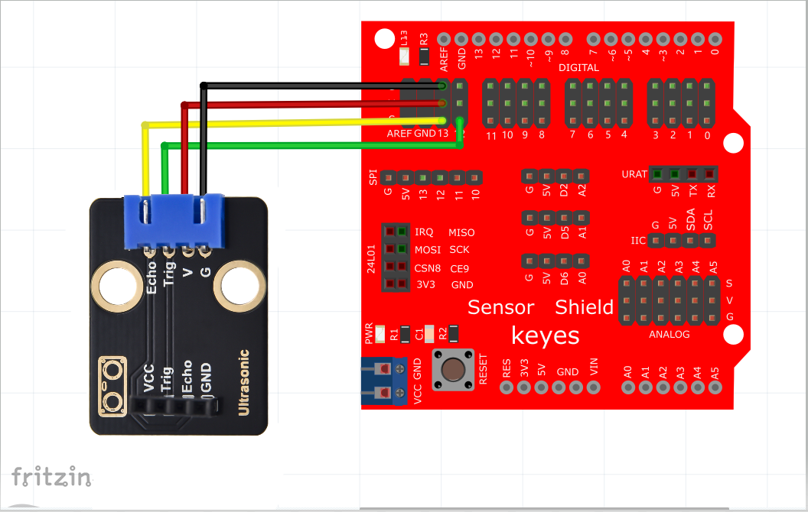

# Arduino


## 1. Arduino简介  

Arduino是一种开源电子原型平台，受到开发者和爱好者的广泛欢迎。它由硬件和软件组成，硬件包括多种开发板，如Arduino UNO、MEGA等，软件主要是Arduino IDE，用于编写和上传代码到开发板上。Arduino适用于许多项目，包括机器人、传感器控制和物联网应用。由于其简单易用的特性和庞大的社区支持，Arduino是学习编程和电子学的理想选择。  

## 2. 接线图  

  

## 3. 测试代码  

```cpp  
int distance = 0; // 定义一个用来接收距离的变量  
int EchoPin = 13; // Echo引脚接D13  
int TrigPin = 12; // Trig引脚接D12  

float checkdistance() { // 获取距离  
    // 预先给出一个短的低电平，以确保一个干净的高脉冲:  
    digitalWrite(TrigPin, LOW);  
    delayMicroseconds(2);  
    
    // 传感器由10微秒或更长时间的高脉冲触发  
    digitalWrite(TrigPin, HIGH);  
    delayMicroseconds(10);  
    digitalWrite(TrigPin, LOW);  
    
    // 读取来自传感器的信号:一个高电平脉冲，  
    // 其持续时间是指从发送ping命令到接收物体回波的时间(以微秒计)  
    float distance = pulseIn(EchoPin, HIGH) / 58.00; // 换算成距离  
    delay(10);  
    return distance;  
}  

void setup() {  
    Serial.begin(9600); // 设置波特率为9600  
    pinMode(TrigPin, OUTPUT); // Trig引脚为输出  
    pinMode(EchoPin, INPUT);  // Echo引脚为输入  
}  

void loop() {  
    distance = checkdistance();  
    if (distance < 2 || distance >= 400) { // 在范围外打印“-1”  
        Serial.println("-1");  
        delay(100);  
    } else { // 打印距离，单位厘米  
        Serial.print("distance:");  
        Serial.print(distance);  
        Serial.println("cm");  
        delay(100);  
    }  
}  
```  

## 4. 代码说明  

HC-SR04超声波传感器的最大测试距离为3-4米，最小测试距离为2厘米。代码设置检测距离小于2厘米或者大于等于400厘米时，串口监视器显示“-1”。在电脑的串口监视器中显示传感器和障碍物之间的距离。  

## 5. 测试结果  

上传测试代码成功后，利用USB上电，打开串口监视器并设置波特率为9600。如果障碍物在测试范围外，串口监视器显示“-1”；否则，将显示超声波传感器与前方障碍物之间的距离，单位为厘米，如下图所示。  


