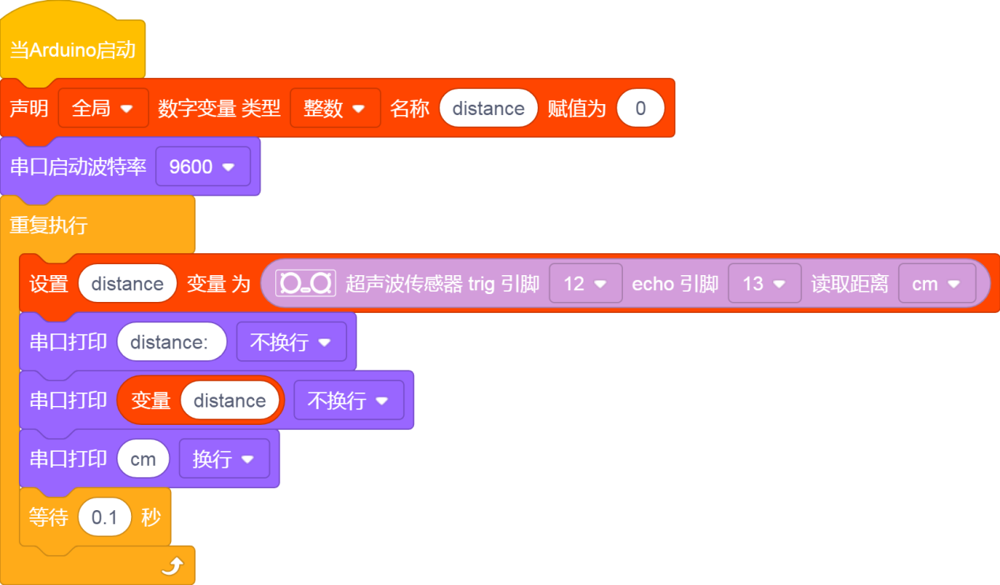
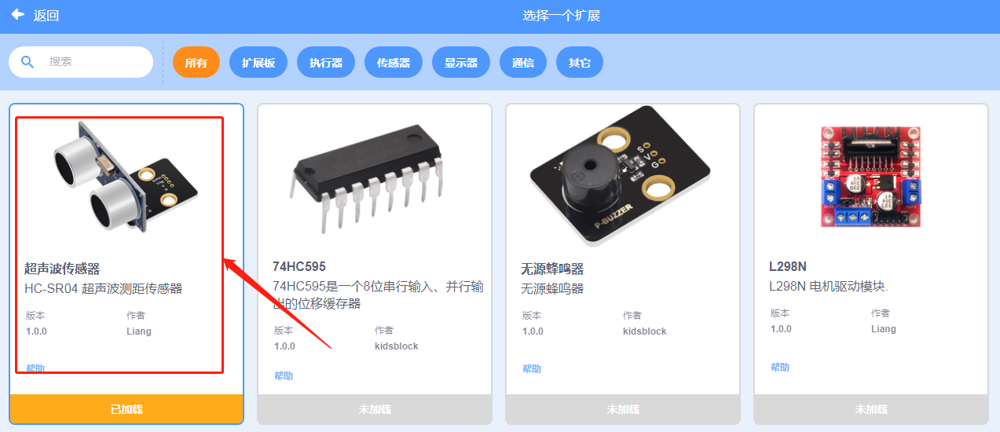
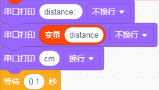
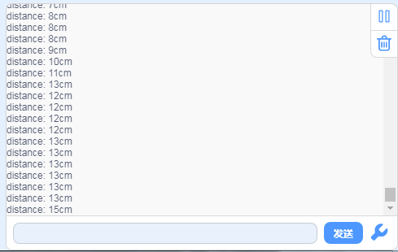

# KidsBlock

## 1. KidsBlock简介  

KidsBlock是一个专为儿童和编程初学者设计的可视化编程平台。它使用模块化的积木方式来创建程序，使得编写代码变得简单有趣。KidsBlock以增强儿童的逻辑思维和问题解决能力为目标，用户可以通过拖放不同的代码模块来创建动画、游戏和互动故事。该平台支持多种编程语言，并兼容 Arduino 平台，帮助儿童在实践中学习基础编程原理和电子知识。通过使用KidsBlock，孩子们能够更快地理解计算机编程的基本概念，并激发他们的创造力。  

## 2. 接线图  

  

## 3. 测试代码  

  

## 4. 代码说明  

1. 我们先声明一个整数变量，并把变量名改为：“distance”，赋初值为0。  

  

2. 添加扩展超声波传感器模块。  

根据接线，将Trig设置为12，Echo设置为13。  

  

3. 然后我们把距离赋给变量distance。  

  

4. 我们在电脑的串口监视器中显示传感器和障碍物之间的距离。  

  

## 5. 测试结果  

上传测试代码成功，利用USB上电后，串口监视器显示超声波传感器和前方障碍物之间的距离，单位为cm，如下图。  

