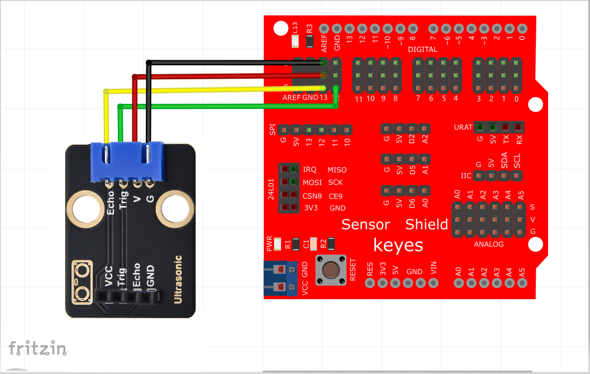
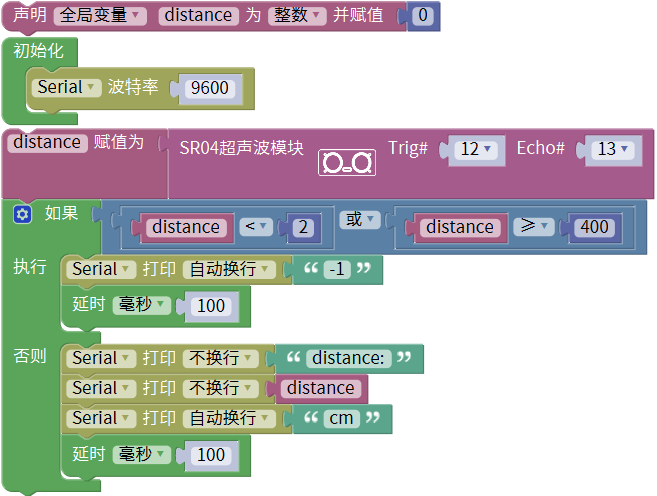
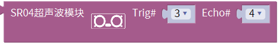
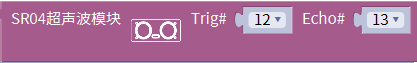
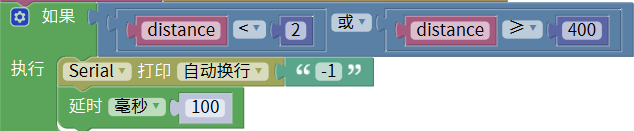
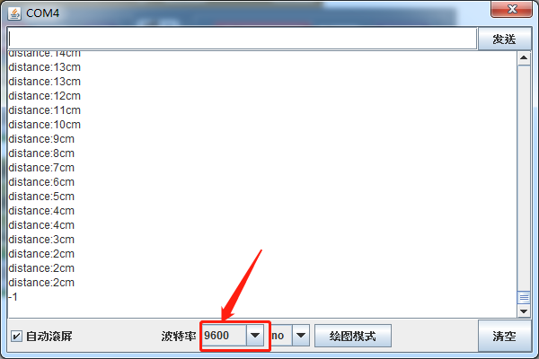

# Mixly

## 1. Mixly简介  

Mixly是一个基于Scratch理念开发的图形化编程工具，旨在帮助初学者和儿童学习编程及电子技术。用户可以通过拖放模块来创建程序，简化了编程的学习曲线。Mixly支持多种硬件平台，包括Arduino和一些传感器，使其成为进行机器人和电子项目的理想选择。该工具结合了可视化编程和代码编写的功能，使得编程变得更加直观和有趣。通过Mixly，学习者能够快速上手并进行各种创意项目。  

## 2. 接线图  

  

## 3. 测试代码（测试软件版本：Mixly1.2.0）  

  

## 4. 代码说明  

1. 我们先声明一个整数变量，并把变量名改为：“distance”，赋初值为0。  

  

2. 导入库函数keyes sensor，我们在库keyes sensor下的“其他模块”单元找到超声波传感器模块。  

根据接线，将Trig设置为12，Echo设置为13。  

  

3. HC-SR04超声波传感器最大测试距离为3-4m，最小测试距离为2cm。设置代码当检测距离小于2cm或者大于等于400cm时，串口监视器显示-1。  

  

4. 我们在电脑的串口监视器中显示传感器和障碍物之间的距离。  

  

## 5. 测试结果  

上传测试代码成功，利用USB上电后，打开串口监视器并设置波特率为9600。如果障碍物在测试范围外，串口监视器显示“-1”；否则，串口监视器显示超声波传感器和前方障碍物之间的距离，单位为厘米，如下图所示。  

