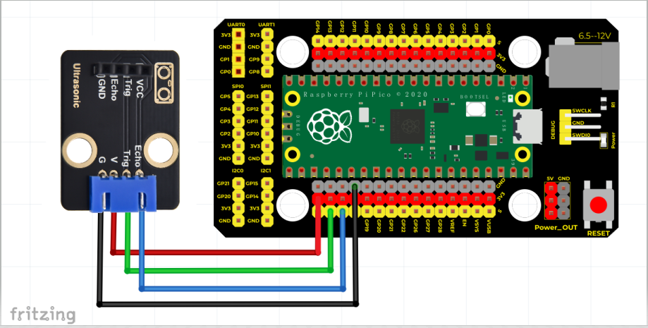
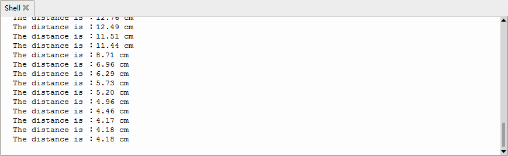

# Python


## 1. Python简介  

Python是一种广泛使用的高级编程语言，以其简洁的语法和强大的功能受到开发者的青睐。它支持多种编程范式，包括面向对象、命令式和函数式编程。Python的强大之处在于其庞大的标准库和丰富的第三方库，使得开发者能够快速有效地构建各种应用程序。Python广泛应用于科学计算、数据分析、Web开发、人工智能等领域。由于其易于学习和使用，Python成为编程入门的理想选择，特别适合初学者和教育用途。  

## 2. 接线图  

  

| 树莓派PICO | 超声波转接模块 |  
|------------|----------------|  
| 3.3V      | V              |  
| GND       | G              |  
| GPIO16    | trig           |  
| GPIO17    | Echo           |  

## 3. 测试代码（测试软件版本：Thonny 3.3.3）  

```python  
from machine import Pin  
import utime  

# 超声波测距，单位：厘米  
def getDistance(trigger, echo):  
    # 产生10us的方波  
    trigger.low()  # 预先给出一个短的低电平，以确保一个干净的高脉冲:  
    utime.sleep_us(2)  
    trigger.high()  
    utime.sleep_us(10)  # 拉高电平後，等待10微秒后，立即设置为低电平  
    trigger.low()  

    while echo.value() == 0:  
        # 建立一个while循环检测回波引脚是否值为0，记录当时时间  
        start = utime.ticks_us()  

    while echo.value() == 1:  
        # 建立一个while循环检测回波引脚是否值为1，记录当时时间  
        end = utime.ticks_us()  

    d = (end - start) * 0.0343 / 2  # 声波行进时间 x 声速(343.2 m/s，即每微秒0.0343公分)，来回距离再除以2  
    return d  

# 设置引脚  
trigger = Pin(16, Pin.OUT)  
echo = Pin(17, Pin.IN)  

# 主程序  
while True:  
    distance = getDistance(trigger, echo)  
    print("The distance is ：{:.2f} cm".format(distance))  
    utime.sleep(0.1)  
```  

## 4. 代码说明  

HC-SR04超声波传感器最大测试距离为3-4米，最小测试距离为2厘米。代码通过判断检测到的距离，当距离小于2厘米或大于等于400厘米时，控制显示为"-1"。在电脑的Shell中可以实时显示传感器与障碍物之间的距离，这对进行基础的自动化和机器人项目非常有用。  

## 5. 代码运行说明  

utime.ticks_us()函数用于返回程序运行到当前的微秒数，帮助计算声波行进的时间，从而计算距离。  

## 6. 测试结果  

运行测试代码后，用户可以在下方Shell中观察超声波传感器与前方障碍物之间的距离，单位为厘米，结果如下图所示。  




